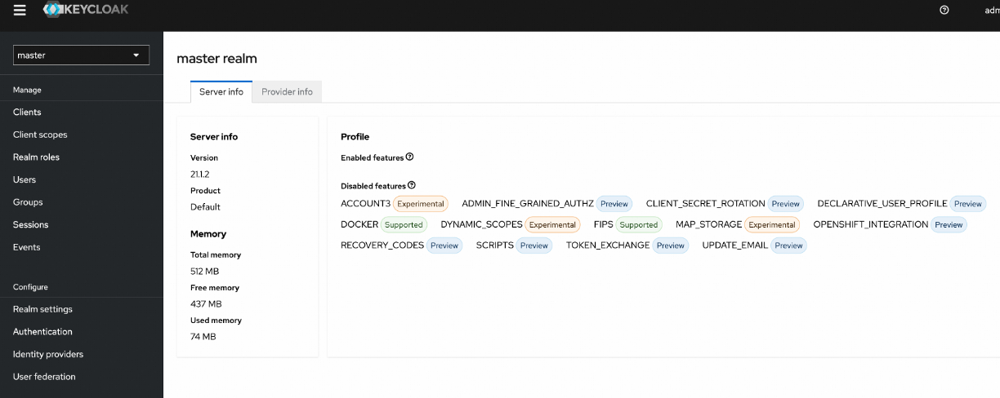

Palworld is a new survival game developed by Pocketpair. The game became extremely popular overnight, hitting 2 million concurrent players. However, Pocketpair's servers are struggling to keep up with the large number of players. To solve this issue, Pocketpair allows players to set up dedicated servers, which offers the following advantages:

(1) greater stability to reduce the risk of crashes or downtime;

(2) easy adjustment of the server player count to 4, 12, or 32 players;

(3) control over server settings to allow for customization of gameplay elements, rules, and mods, creating a tailored experience for the gaming community.

This topic describes how to establish a dedicated server for Palworld in Alibaba Cloud with a few clicks. You only need to configure the settings on the page as prompted. Then, the system will automatically create an ECS instance, configure the port and firewall, and install the game environment. The whole process takes only 2 to 3 minutes with no coding involved.

# Create an ECS instance
## Step 1: Go to the Rapid Deployment of Palworld online services page

(1) Log on to the Alibaba Cloud International site [alibabacloud.com](https://www.alibabacloud.com).

(2) Visit the "[Rapid deployment of Palworld online services](https://computenest.console.aliyun.com/service/instance/create/ap-southeast-1?type=user&ServiceId=service-1cdad6b8bab640d4bf55)" page  and click Launch Now.

Most required settings, including the network protocol and port (UDP protocol and port 8211), are pre-configured.
## Step 2: Configure the ECS instance
On the Create Service Instance page, configure the following parameters:

(1) **Service Instance Name**: Enter the instance name. We recommend that you use the default name.

(2) **Region**: Select the region where you want to deploy the ECS instance. We recommend that you use the default value, which is the city closest to you.

(3) **Pay Period Unit and Period**: Select a subscription duration for the ECS instance. We recommend that you specify three months as the subscription duration.

(4) **Select the ECS instance specifications**. Higher specifications result in a smoother gaming experience. Palworld is a memory-intensive game. We recommend that you specify 4vCPU 16GiB or higher specifications for your ECS instance. 4vCPU 16GiB is recommenced by Pocketpair, developer of the game. For more information, visit https://tech.palworldgame.com/dedicated-server-guide. We recommend that you set the **Internet Charge Type** parameter to **Pay-by-bandwidth**. The pay-by-bandwidth metering method does not impose limits on the bandwidth, which reduces latency and provides a better gaming experience.

(5) **Instance Password**: Enter a password for the ECS instance. The password is required when you log on to the ECS instance.
(6) **Availability Zone**: Select the zone in which the ECS instance resides. We recommend that you use the default zone.
After you complete the configurations, click Next: Confirm Order to submit the order.
## Step 3: Purchase the service
In the Terms of Service section, read and select the check box to agree to the terms of service and then click Create Now to create an order.

If the Submitted message appears, it indicates that the order was created successfully. You can click View Service to view the instance.

If you create a subscription-type order, you'll find an unpaid instance, click "Complete Payment" and finish the payment, the instance will be deployed immediately.

## Step 4: Obtain the IP address of the ECS instance
The ECS instance can be created in less than a minute. When the status of the instance changes to **Deployed**, click the ID of the instance to go to the instance details page.
In this step, the Palworld server installation program is preloaded in the image of the ECS instance that you created.

On the Overview tab, the IP address of the ECS instance is displayed in the Service Addresses field, which will be used for subsequent configuration

# Start a multiplayer game
(1) Launch Palworld and select Join Multiplayer Game from the main menu.

Enter the IP address obtained in Sub-step 4 of Step 1 in the text box at the bottom of the page and click **Connect**.

You are now ready to play!

An out-of-memory issue may occur during the running of the game. A quick solution to mitigate the impact of this issue is to regularly restart your server. We recommend that you create a scheduled task in the Alibaba Cloud Manage Console to automatically restart your ECS instance during off-peak hours.
