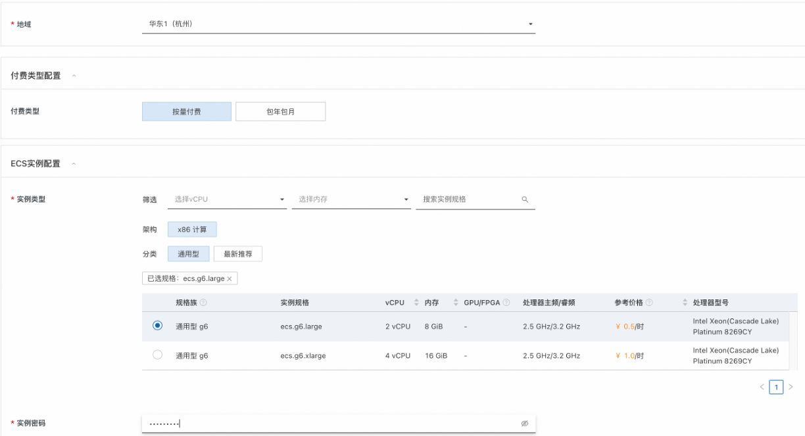

## 介绍
Keycloak 是一个开源的身份和访问管理解决方案，适用于现代应用程序和服务。它提供了一整套安全性认证和管理特性，能够帮助开发者轻松实现安全认证和单点登录(SSO)。 

1. 用户联邦 (User Federation): Keycloak 支持与现有的用户存储进行集成，如 LDAP 或 Active Directory，允许用户使用现有的身份凭证进行登录。
2. 身份代理和社交登录 (Identity Brokering and Social Login): 提供了与外部身份提供者（如 Facebook, Google, Twitter 等）的集成，用户可以使用社交账户进行登录，同时支持标准协议例如 OpenID Connect, SAML 2.0, 和 OAuth 2.0。
3. 精细的访问控制 (Fine-grained Authorization): Keycloak 允许创建详细的访问控制策略，为每个用户或组定义特定的角色与权限，确保只有合适的用户能够访问敏感资源。

## 前提条件
使用Keycloak服务实例，需要对部分阿里云资源进行访问和创建操作。因此您的账号需要包含如下资源的权限。
**说明**：当您的账号是RAM账号时，才需要添加此权限。

| 权限策略名称 | 备注 |
| --- | --- |
| AliyunECSFullAccess | 管理云服务器服务（ECS）的权限 |
| AliyunVPCFullAccess | 管理专有网络（VPC）的权限 |
| AliyunROSFullAccess | 管理资源编排服务（ROS）的权限 |
| AliyunComputeNestSupplierFullAccess | 管理计算巢服务（ComputeNest）的商家侧权限 |

### 计费说明

Keycloak部署涉及的费用主要涉及：

- 云服务器服务（ECS）费用
- 流量带宽费用
### 参数说明

| 参数组        | 参数项                | 说明                                                                         |
|------------|--------------------|----------------------------------------------------------------------------|
| 服务实例       | 服务实例名称             | 长度不超过64个字符，必须以英文字母开头，可包含数字、英文字母、短划线（-）和下划线（_）                              |
|            | 地域                 | 服务实例部署的地域                                                                  |                                                             |                                                                 |
| 付费类型配置     | 付费类型               | 按量付费/包年包月                                                                  |
| ECS实例配置    | 实例类型               | 部署的ECS实例类型                                                                 |
|            | 实例密码               | 服务器登录密码,长度8-30，必须包含三项（大写字母、小写字母、数字、 ()`~!@#$%^&*_-+=｜{}[]:;'<>,.?/ 中的特殊符号） |
| 可用区配置      | 交换机可用区             | 该实例类型可部署的可用区                                                               |
| 网络配置       | 是否新建VPC            | 选择是否在当前可用区新建VPC                                                            |
|            | 专有网络VPC实例Id        | 选择当前可用区下的VPC实例                                                             |
|            | 交换机实例Id            | 选择当前VPC支持的交换机                                                              |
 | Keycloak配置 | 是否在Keycloak接入阿里云认证 | 如选择"是"，则会在Keycloak里创建打通阿里云认证的Identity provider                             |
|            | RealmName          | 阿里云认证Identity provider和登录Client所在领域                                        |
 |            | KeycloakAdminUserName                   |管理员账号名|
 |            | KeycloakAdminPassword| 管理员密码|

## 部署流程
1. 选择付费类型
2. 选择部署地域
3. 选择要部署的ECS实例规格和输入实例密码
   
4. 选择交换机可用区，这是由您选择的ECS实例规格决定的
5. 选择/新建专有网络(VPC)和交换机(VSW)
6. 选择是否接入阿里云认证。如选择则在您输入的RealmName中构建一个Identity provider和一个Client。同时在阿里云[OAuth](https://ram.console.aliyun.com/)处构建认证Client。
7. 输入keycloak的管理账号和密码
   

## 使用
### 访问控制台
1. 进入部署的计算巢实例的控制台界面。
   
2. 如在之前选择接入阿里云认证，则控制台会额外输出OAuthClientId和OAuthClientSecret。这既是Keycloak中登录APP的Id和Secret也是阿里云OAuth认证的Id和Secret。
3. 控制台输出的KeycloakEndpoint为Keycloak服务的访问地址。
   
4. 点击"Administration Console"，输入您设置的账号名和密码则可进入Keycloak管理界面。
   

### 领域配置

安全隔离：每个realm相当于一个独立的命名空间，可以包含自己的用户、角色、客户端（应用程序）和其他身份管理相关的配置。这使得在同一个Keycloak服务器上可以为不同的组织或项目提供隔离的安全环境。

用户管理：在特定的realm内部，管理员可以创建和管理用户账号，分配角色和权限，并进行用户身份验证和授权管理。

客户端应用程序管理：每个realm都可以配置和管理自己的客户端应用程序，这些客户端应用程序可以是网页应用、单页应用（SPA）、移动应用或后端服务。

身份提供者：realm支持与各种外部身份提供者（如Facebook、Google、微软等）以及企业身份管理系统（如LDAP、Active Directory）的集成。

认证流程：realm允许自定义认证流程，这样可以根据具体需求调整登录过程，包括多因素认证（MFA）或单点登录（SSO）的配置。

协议支持：Keycloak支持多种标准的身份认证协议，如OpenID Connect、OAuth 2.0和SAML 2.0，realm内的配置决定了这些协议的具体实现和行为。

事件和审计：Keycloak的realm具备事件记录和审计功能，可以追踪和记录用户活动，如登录尝试、密码更新等，便于监控和合规性检查。

主题和国际化：realm可以自定义用户界面的外观和感觉，支持不同的主题，并提供国际化选项。

令牌配置：在realm中可以配置不同类型的令牌（如访问令牌、刷新令牌、ID令牌等），包括它们的有效期、签名算法等。

安全策略：管理员可以在realm内定义密码策略、会话策略、令牌策略等，以增强系统的安全性。

Keycloak在创建时会有一个默认的realm，通常叫做"master"，用于管理整个Keycloak实例。管理员可以在master realm中创建新的realms，并为这些realms配置适当的安全策略和用户访问规则。通过这种方式，Keycloak可以灵活地适应各种复杂的安全需求。

### 主题和Style
Keycloak支持自定义界面主题，包括登录页面、管理员控制台、账户管理界面和邮件模板。

1. **更改主题：**
   - 在领域设置中，选择“Themes”选项卡。
   - 对于每个不同的界面，您可以从下拉菜单中选择一个主题。
   - 保存更改。
2. **创建自定义主题：**
   - 自定义主题需要在Keycloak服务器的主题目录中创建。
   - 创建一个新文件夹，使用您所选择的主题名称。
   - 在该文件夹中创建子文件夹和文件，用于定义页面的HTML、样式CSS和脚本。
   - 重新启动Keycloak服务器以加载新主题。
   - 在管理控制台中选择新主题作为活动主题。
### 用户管理
用户管理是在领域中完成的，涉及添加、编辑、删除用户和管理用户属性、凭据、角色和组。

1. **添加新用户：**
   - 在领域配置中，选择“Users”菜单项。
   - 点击“Add user”按钮。
   - 填写必要的用户信息，如用户名、电子邮件、名字、姓氏等。
   - 点击“Save”以创建用户。
2. **编辑用户属性：**
   - 在用户列表中，点击特定用户的用户名。
   - 您可以编辑用户的基本属性、角色映射、组成员身份、用户凭据，甚至管理用户的会话。
3. **用户角色和细粒度管理：**
   - Keycloak中的角色可以指定给用户，用户组或者整个领域。
   - 在用户编辑界面，选择“Role Mappings”选项卡为用户分配领域或客户端级别的角色。
   - 您还可以管理组织单位，简化对用户的角色分配。

用户管理非常灵活，允许管理员通过内置的管理控制台或者使用REST API来进行自动化的用户操作。
